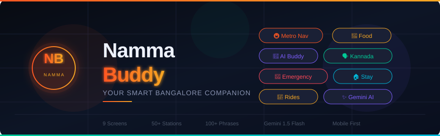
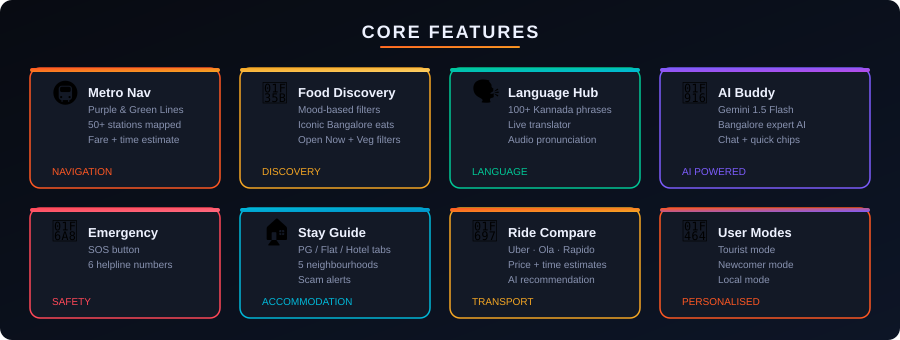
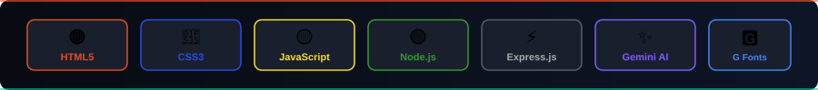

<p align="center">
  
</p>

<p align="center">
  
  
  
  
  
</p>

---

**Namma Buddy** is an all-in-one web companion app built for tourists, newcomers, and locals navigating Bangalore. It consolidates metro navigation, food discovery, Kannada language support, emergency services, accommodation guides, and an AI-powered chatbot — all in a single mobile-first interface.

---

## What I Built

Bangalore is one of India's most complex cities — a tech hub with a rich local culture, a dense metro network, a language barrier for non-Kannada speakers, and a fast-moving lifestyle that can overwhelm anyone new to the city. I built Namma Buddy to solve exactly that.

Instead of juggling Google Maps, Zomato, Google Translate, and multiple browser tabs, users get one focused app that speaks the language of Bangalore.

---

## Features

<p align="center">
  
</p>

### User Modes
Three tailored experiences based on who you are:
- **Tourist** — Quick access to attractions, food spots, emergency contacts, and transport
- **Newcomer** — Accommodation guides, area comparisons, scam alerts, and survival tips
- **Local** — Language tools, quick transport references, and discovery features

### Metro Navigation
- Full **Purple Line** (26 stations: Baiyappanahalli ↔ Mysuru Road) and **Green Line** (24 stations: Nagasandra ↔ Silk Institute) mapped
- Interchange routing via Majestic (Nadaprabhu Kempegowda Station)
- Real-time fare and travel time estimation
- Metro tips: token costs, timings, and safety notes

### Food Discovery
- Mood-based filters: Budget Meal, Café, Late Night, Work Café, Date Night, Healthy
- Filter by: Open Now, Veg/Non-Veg, price range, distance
- Iconic Bangalore Eats section featuring legendary spots like Vidyarthi Bhavan, Empire Restaurant, Koshy's, and more

### Language Hub
- **100+ Kannada phrases** organized by category: Transport, Food, Greetings, Emergency, Directions
- **Live Translator** — English to Kannada with romanized pronunciation
- **Quick Type Mode** — large-display Kannada text to show locals on-screen
- **Audio Pronunciation** via Web Speech Synthesis API

### AI Buddy (Gemini-Powered)
- Conversational AI specialized in Bangalore knowledge
- Covers: food recs, metro routes, airport travel, area guides, auto-rickshaw tips, scam prevention, Kannada phrases, weekend activities
- Quick-chip shortcuts for common questions
- Typing indicator and full chat history

### Emergency & Safety
- One-tap SOS button (hold 2 seconds to activate)
- Emergency directory: 112, Police (100), Ambulance (108), Fire (101), Women Helpline (1091), Tourist Helpline (1363)
- Nearest hospital, police station, pharmacy, and ATM finder

### Stay & Accommodation
- PG, Flat, and Hotel tabs
- Neighborhood breakdown with rental ranges:

| Area | Avg Rent | Highlights |
|---|---|---|
| Indiranagar | ₹18K+/mo | Metro connected, nightlife |
| Koramangala | ₹16K+/mo | Startup hub, food scene |
| HSR Layout | ₹14K+/mo | Tech startups |
| JP Nagar | ₹10K+/mo | Peaceful, family-friendly |
| Marathahalli | ₹9K+/mo | IT corridor, budget |

- Common scam alerts to protect new arrivals
- Direct links to NoBroker, OYO, Airbnb, Booking.com

### Ride Comparison
- Side-by-side comparison: Metro, BMTC, Auto, Uber, Rapido, Ola
- Price estimates, travel time, and comfort ratings
- AI-powered ride recommendation via backend API

---

## Tech Stack

<p align="center">
  
</p>

| Layer | Technology |
|---|---|
| Frontend | HTML5, CSS3, Vanilla JavaScript |
| Backend | Node.js + Express.js (v5) |
| AI | Google Gemini 1.5 Flash (`@google/generative-ai`) |
| Fonts | Syne, DM Sans, JetBrains Mono (Google Fonts) |
| APIs | Web Speech Synthesis, Clipboard API, Geolocation |
| Data | JSON-based local database |

---

## Project Structure

```
NammaBuddy/
├── assets/
│   ├── banner.svg          # Project banner
│   ├── features.svg        # Feature overview diagram
│   └── techstack.svg       # Tech stack visual
├── frontend/
│   └── NammaBuddy_Final_Submission.html   # Complete single-page app
└── backend/
    ├── server.js           # Express server + Gemini AI integration
    ├── database.json       # Metro routes, ride data, language phrases
    └── package.json
```

The frontend is a fully self-contained single-page app — all screens, styles, and logic in one file. The backend handles AI chat and serves structured data via REST endpoints.

---

## API Endpoints

| Method | Endpoint | Description |
|---|---|---|
| GET | `/metro` | Metro route data |
| GET | `/rides` | Transport options and pricing |
| GET | `/language` | Kannada phrase library |
| POST | `/aiRide` | AI-powered ride recommendation |

---

## Getting Started

### Prerequisites
- Node.js v18+
- A Google Gemini API key

### Backend Setup

```bash
cd backend
npm install
```

Add your Gemini API key in `server.js`:

```js
const API_KEY = "your-gemini-api-key-here";
```

```bash
node server.js
# Server runs on http://localhost:5000
```

### Frontend

Open `frontend/NammaBuddy_Final_Submission.html` directly in a browser, or serve it with any static file server.

---

## Design System

- **Dark theme**: Background `#080B12`, Surface `#131926`
- **Primary palette**: Orange `#FF5722`, Gold `#F5A623`
- **Accents**: Green `#00C896`, Teal `#00B8D9`, Purple `#7C5CFC`
- **Mobile-first**: Fixed 420px max-width, optimized for phone viewport
- **UI effects**: Glassmorphism, smooth fade transitions, pulsing animations

---

## Built With Purpose

Bangalore has over 13 million people and receives thousands of new arrivals every month — students, tech workers, and tourists. Language barriers, confusing transit, and the risk of scams make the first few weeks hard. Namma Buddy is built to make that experience better — not with a generic city guide, but with a focused, fast, mobile-ready tool that actually knows Bangalore.

---

## Author

**Rishi Reddy**  
GitHub: [@Rishi6688](https://github.com/Rishi6688)
